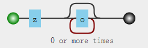

# 限定符

限定符也指数量词（Quantifiers），用来指定正则表达式的一个给定模式必须要出现多少次才能满足匹配

## 限定符集

<table>
  <thead>
    <tr>
      <th style="text-align:left">&#x5B57;&#x7B26;</th>
      <th style="text-align:left">&#x63CF;&#x8FF0;</th>
    </tr>
  </thead>
  <tbody>
    <tr>
      <td style="text-align:left">*</td>
      <td style="text-align:left">
        <ul>
          <li>&#x5339;&#x914D;&#x524D;&#x9762;&#x7684;&#x5B50;&#x8868;&#x8FBE;&#x5F0F;&#x96F6;&#x6B21;&#x6216;&#x591A;&#x6B21;</li>
          <li>&#x4F8B;&#x5982;&#xFF0C;zo* &#x80FD;&#x5339;&#x914D; &quot;z&quot; &#x4EE5;&#x53CA;
            &quot;zoo&quot;&#xFF0C;* &#x7B49;&#x4EF7;&#x4E8E;{0,}</li>
        </ul>
      </td>
    </tr>
    <tr>
      <td style="text-align:left">+</td>
      <td style="text-align:left">
        <ul>
          <li>&#x5339;&#x914D;&#x524D;&#x9762;&#x7684;&#x5B50;&#x8868;&#x8FBE;&#x5F0F;&#x4E00;&#x6B21;&#x6216;&#x591A;&#x6B21;</li>
          <li>&#x4F8B;&#x5982;&#xFF0C;&apos;zo+&apos; &#x80FD;&#x5339;&#x914D; &quot;zo&quot;
            &#x4EE5;&#x53CA; &quot;zoo&quot;&#xFF0C;+ &#x7B49;&#x4EF7;&#x4E8E; {1,}</li>
        </ul>
      </td>
    </tr>
    <tr>
      <td style="text-align:left">?</td>
      <td style="text-align:left">
        <ul>
          <li>&#x5339;&#x914D;&#x524D;&#x9762;&#x7684;&#x5B50;&#x8868;&#x8FBE;&#x5F0F;&#x96F6;&#x6B21;&#x6216;&#x4E00;&#x6B21;</li>
          <li>&#x4F8B;&#x5982;&#xFF0C;&quot;do(es)?&quot; &#x53EF;&#x4EE5;&#x5339;&#x914D;
            &quot;do&quot; &#x3001; &quot;does&quot; &#xFF0C;? &#x7B49;&#x4EF7;&#x4E8E;
            {0,1}</li>
        </ul>
      </td>
    </tr>
    <tr>
      <td style="text-align:left">
        <p>*?</p>
        <p>+?</p>
      </td>
      <td style="text-align:left">
        <ul>
          <li>&#x50CF; * &#x548C; + &#x4E00;&#x6837;&#x5339;&#x914D;&#x524D;&#x9762;&#x7684;&#x6A21;&#x5F0F;&#xFF0C;&#x4F46;&#x5339;&#x914D;&#x662F;&#x6700;&#x5C0F;&#x53EF;&#x80FD;&#x5339;&#x914D;</li>
          <li>&#x4F8B;&#x5982;&#xFF0C;/&quot;.*?&quot;/<em>&#x5339;&#x914D; &apos;&quot;foo&quot; &quot;bar&quot;&apos; &#x4E2D;&#x7684; &apos;&quot;foo&quot;&apos;</em>
          </li>
          <li>&#x540E;&#x9762;&#x6CA1;&#x6709; ? &#x65F6;&#x5339;&#x914D; &apos;&quot;foo&quot;
            &quot;bar&quot;&apos;</li>
        </ul>
      </td>
    </tr>
    <tr>
      <td style="text-align:left">x(?=y)</td>
      <td style="text-align:left">
        <ul>
          <li>&#x53EA;&#x6709;&#x5F53;<em><code>x</code></em>&#x540E;&#x9762;&#x7D27;&#x8DDF;&#x7740; <em><code>y</code></em> &#x65F6;&#xFF0C;&#x624D;&#x5339;&#x914D; <em><code>x</code></em>
          </li>
          <li>&#x4F8B;&#x5982;&#xFF0C;<code>/x(?=y)/</code>&#x53EA;&#x6709;&#x5728;
            &apos;x&apos; &#x540E;&#x9762;&#x7D27;&#x8DDF;&#x7740; &apos;y&apos; &#x65F6;&#xFF0C;&#x624D;&#x4F1A;&#x5339;&#x914D;&#x5B83;</li>
          <li>&#x4F46;y&#x4E0D;&#x662F;&#x5339;&#x914D;&#x7ED3;&#x679C;&#x7684;&#x4E00;&#x90E8;&#x5206;</li>
        </ul>
      </td>
    </tr>
    <tr>
      <td style="text-align:left">x(?!y)</td>
      <td style="text-align:left">
        <ul>
          <li>&#x53EA;&#x6709;&#x5F53; <em><code>x</code></em> &#x540E;&#x9762;&#x4E0D;&#x662F;&#x7D27;&#x8DDF;&#x7740; <em><code>y</code></em> &#x65F6;&#xFF0C;&#x624D;&#x5339;&#x914D; <em><code>x</code></em>
          </li>
          <li>&#x4F8B;&#x5982;&#xFF0C;<code>/\d+(?!\.)/.exec(&quot;3.141&quot;)</code> &#x5339;&#x914D;
            141 &#x800C;&#x4E0D;&#x662F; 3.141</li>
        </ul>
      </td>
    </tr>
    <tr>
      <td style="text-align:left">{n}</td>
      <td style="text-align:left">
        <ul>
          <li>n &#x662F;&#x4E00;&#x4E2A;&#x975E;&#x8D1F;&#x6574;&#x6570;</li>
          <li>&#x5339;&#x914D;&#x786E;&#x5B9A;&#x7684; n &#x6B21;</li>
          <li>&#x4F8B;&#x5982;&#xFF0C;&apos;o{2}&apos; &#x4E0D;&#x80FD;&#x5339;&#x914D;
            &quot;Bob&quot; &#x4E2D;&#x7684; &apos;o&apos;&#xFF0C;&#x5339;&#x914D;
            &quot;food&quot; &#x4E2D;&#x7684;&#x4E24;&#x4E2A; o</li>
        </ul>
      </td>
    </tr>
    <tr>
      <td style="text-align:left">{n,}</td>
      <td style="text-align:left">
        <ul>
          <li>n &#x662F;&#x4E00;&#x4E2A;&#x975E;&#x8D1F;&#x6574;&#x6570;</li>
          <li>&#x81F3;&#x5C11;&#x5339;&#x914D;n &#x6B21;</li>
          <li>&#x4F8B;&#x5982;&#xFF0C;&apos;o{2,}&apos; &#x4E0D;&#x80FD;&#x5339;&#x914D;
            &quot;Bob&quot; &#x4E2D;&#x7684; &apos;o&apos;&#xFF0C;&#x5339;&#x914D;
            &quot;foooood&quot; &#x4E2D;&#x7684;&#x6240;&#x6709; o</li>
          <li>&apos;o{1,}&apos; &#x7B49;&#x4EF7;&#x4E8E; &apos;o+&apos;&#xFF0C;&apos;o{0,}&apos;
            &#x5219;&#x7B49;&#x4EF7;&#x4E8E; &apos;o*&apos;</li>
        </ul>
      </td>
    </tr>
    <tr>
      <td style="text-align:left">{n,m}</td>
      <td style="text-align:left">
        <ul>
          <li>m &#x548C; n &#x5747;&#x4E3A;&#x975E;&#x8D1F;&#x6574;&#x6570;&#xFF0C;&#x5176;&#x4E2D;n
            &lt;= m</li>
          <li>&#x6700;&#x5C11;&#x5339;&#x914D; n &#x6B21;&#x4E14;&#x6700;&#x591A;&#x5339;&#x914D;
            m &#x6B21;</li>
          <li>&#x4F8B;&#x5982;&#xFF0C;&quot;o{1,3}&quot; &#x5C06;&#x5339;&#x914D; &quot;fooooood&quot;
            &#x4E2D;&#x7684;&#x524D;&#x4E09;&#x4E2A; o</li>
          <li>&apos;o{0,1}&apos; &#x7B49;&#x4EF7;&#x4E8E; &apos;o?&apos;</li>
          <li>&#x6CE8;&#x610F;&#x5728;&#x9017;&#x53F7;&#x548C;&#x4E24;&#x4E2A;&#x6570;&#x4E4B;&#x95F4;&#x4E0D;&#x80FD;&#x6709;&#x7A7A;&#x683C;</li>
        </ul>
      </td>
    </tr>
  </tbody>
</table>

## 限定符模式

### 贪婪模式

> 贪婪模式，指在整个表达式匹配成功的前提下，尽可能多的匹配；贪婪模式的量词："{m,n}"，"{m,}"，"?"，"\*"和"+"

* 匹配o子表达式零次或多次

```javascript
/zo*/.test('zooooooo'); // true
/zo{0,}/.test('zooooooo'); // true

/zo*/.test('zmooooo'); // true
/zo{0,}/.test('zooooooo'); // true
```



* 匹配o子表达式一次或多次

```javascript
/zo+/.test('zooooooo'); // true
/zo{1,}/.test('zooooooo'); // true

/zo+/.test('zmooooo'); // false
/zo{1,}/.test('zmooooo'); // false
```


* 匹配o子表达式零次或一次

```javascript
/zo?/.test('zooooooo'); // true
/zo{0,1}/.test('zooooooo'); // true

/zo?/.test('zmooooo'); // true
/zo{0,1}/.test('zmooooo'); // true
```


### 非贪婪模式（最小可能匹配）

> 非贪婪模式，指在整个表达式匹配成功的前提下，尽可能少的匹配；在贪婪模式量词后加上“?”，即变成非贪婪模式的量词："{m,n}?"，"{m,}?"，"??"，"\*?"和"+?"

```javascript
// ??和{0,1}? 匹配零个o
/zo??/.exec("zooooo"); // ["z", index: 0, input: "zooooo", groups: undefined]
/zo{0,1}?/.exec("zooooo"); // ["z", index: 0, input: "zooooo", groups: undefined]
```


```javascript
// *?和{0,} 匹配零个o
/zo*?/.exec("zooooo"); // ["z", index: 0, input: "zooooo", groups: undefined]
/zo{0,}?/.exec("zooooo"); // ["z", index: 0, input: "zooooo", groups: undefined]
```


```javascript
// +?和{1,}? 匹配一个o
/zo+?/.exec("zooooo"); // ["zo", index: 0, input: "zooooo", groups: undefined]
/zo{1,}?/.exec("zooooo"); // ["zo", index: 0, input: "zooooo", groups: undefined]
```


### 判断匹配模式

> 判断匹配模式指，某个子表达式后是否存在或不存在某个模式，进而进行匹配

* x\(?=y\) x表达式后存在y表达式

```javascript
/一起学习(?=RegExp)/.test("一起学习RegExp"); // true
/一起学习(?=RegExp)/.test("一起学习React"); // false
```


* x\(?!y\) x表达式后不存在y表达式

```javascript
/一起学习(?!RegExp)/.test("一起学习React"); // true
/一起学习(?!RegExp)/.test("一起学习RegExp"); // false
```


